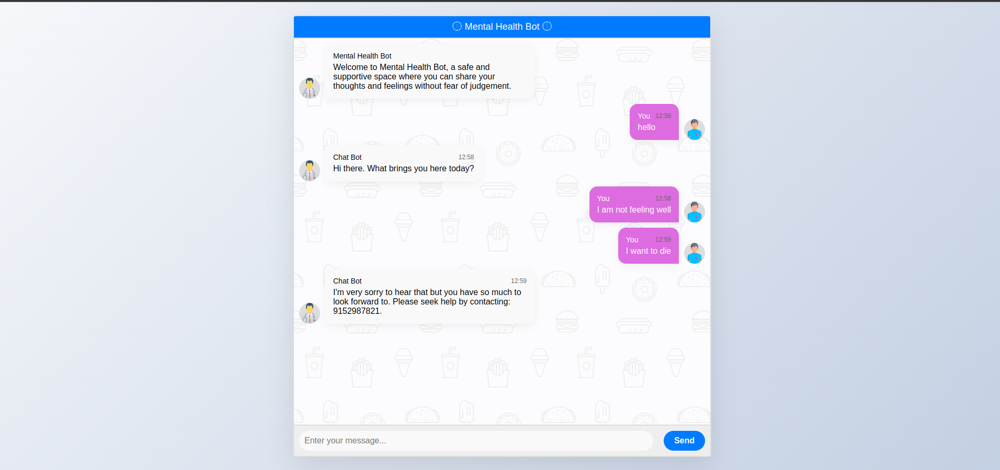

# Mental-health-Chatbot 
This is a chatbot  designed to provide support, information, and guidance related to mental health.

# How to run it?

The following instructions were tested on the Windows and Linux with Python 3.8.

1. Clone this repository

```
git clone https://github.com/Python0p/Mental_Health_Chatbot_Flaskapp.git
```
```
cd Mental_Health_Chatbot_Flaskapp/
```

2. Create and activate virtual environment 

```
python -m venv venv
```
Activation of virtual environment on Linux system
```
source venv/bin/activate
```
Activation of virtual environment on Windows system
```
.\venv\Scripts\activate.bat
```
3. Install requirements

```
pip install  -r requirements.txt
```

4. Run the app
```
python app.py
```
4. If does not run then
```
python3 app.py
```


## AI ChatBot

